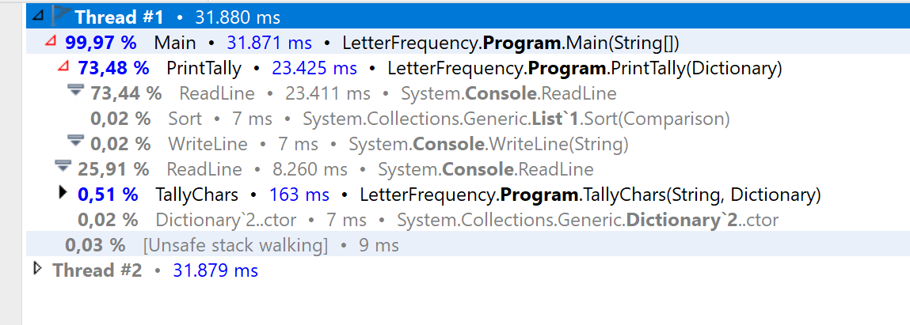
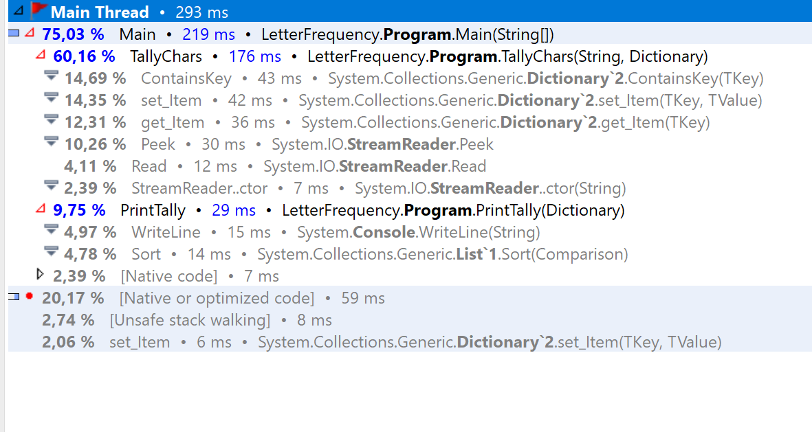

# Assignments-CphBusiness

### This Assignment was originally in Java, but due to various errors and my limited knownledge of Java, i have decided to port it to C#, as best as i can.

***

Running the ported code, my first performance test from when the program begins to when it is done executing is 0.541 seconds, with a constant of 11 mb ram.

the second time i run the program it finishes in 0.17 seconds. 
i can conclude that my results are very hard to verify, when we are talking such a small margin _(mili seconds)_.

In any regard, i decided to run a profiler on the code, using jetbrains dotTrade. 
as can be seen in the picture above, the main "issues" are just my readline() fields, which i use to control the flow in the program. The Readline()'s arent actually a factor on the performance, as they are set up to be hit before the program executes and after the program executes.

After tweaking the program a bit, to make it run with the profiler easier (removing all Readlines(), and having the program run and terminate as soon as it finished, allowed me to get a lot more accurate profile result):

from this i can conclude that its the method TallyChars that takes the longest to complete.

i can conclude that any futher tampering with the code, would likely not increase performance.
if i were to venture a guess as how to improve performance slightly, i would look into a way to cut the txt document in half, and start 2 tasks, with TallyChars( ), and await them. Once they are done, add them together and run them through PrintTally( ).

***

## How to run it

#### if you wish to run this in debug mode:
* first you gotta copy the project
* Edit the path to the local .txt file.
* run.
* if you wanna see time it took, you gotta add a Console.Readline(); at the end of PrintTally

#### if you wish to just see it in action:
* download the Exe file and run it.

