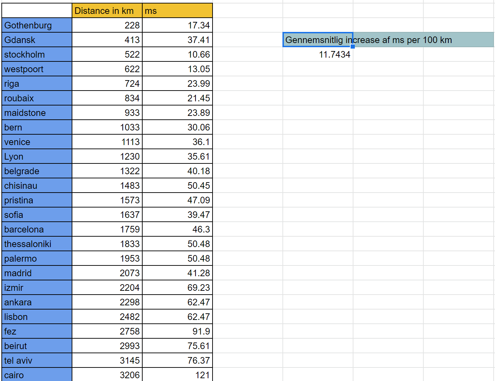

# Assignments-CphBusiness

### Ufo Assignment 3

***

I propose that the futher away a client is from the server, the longer response time we will experience.

To see if I can find a correlation between distance and response time, I will measure the delay of me sending a message and recieving a response back from a server. I will meassure servers in a incrementing distance of 100 km, with copenhagen as a base location.

It is not feasible for me to find servers for every 100 km of distance by myself, so I will this website to help me [Wondernetwork](https://wondernetwork.com/pings/copenhagen).

I have worked out a diagram with the help of the above website:

## conclusion

according to my sample size, there is an avarage ms increase, per 100 km, of 11.74 ms.
So if we want to deliver a faster experience to the customers we would look for a datacenter in a central location depending on the service we provide.

### *possible errors in measurements* 

These measurements are taken in the morning in primarily european countries, where internet connections are useally strong and there exist many different routes to the same location that are close together, which makes the ping lower.

Ideally we would run similair tests in the US and in Asia where our customers experienced problems. 

